# Planora

Planora is a project-management web app for small teams: one shared place to plan projects, assign tasks, and keep an eye on workload. It's a full-stack Next.js application backed by Supabase, with workspace-scoped data and permission-aware server actions.

Work is organized around three concepts:

- **Workspaces** — isolated team environments containing members, roles, projects, and activity. The selected workspace travels in the URL (`?workspace=...`).
- **Projects** — initiatives with an owner, dates, status, team, and milestones.
- **Tasks** — work items with priority, status, assignee, tags, and dates, viewable as a list, Gantt timeline, calendar, or Kanban board with drag-and-drop.

## Screenshots

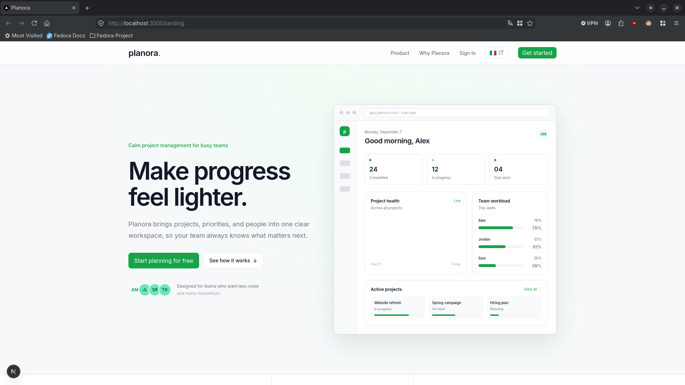
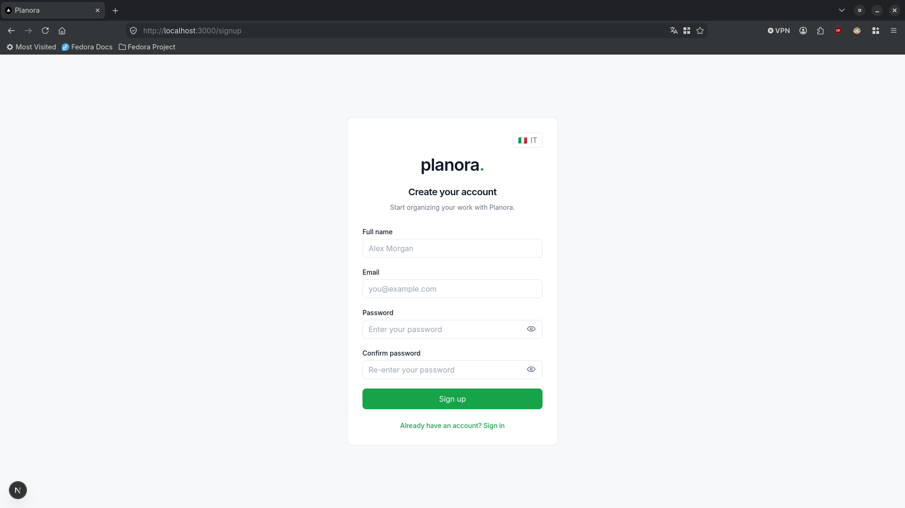
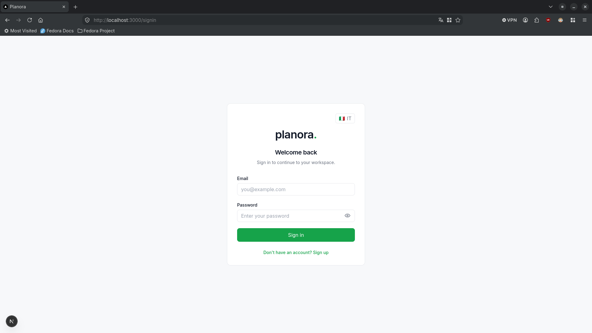
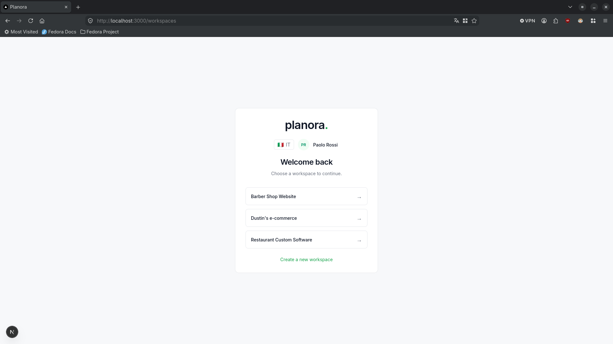
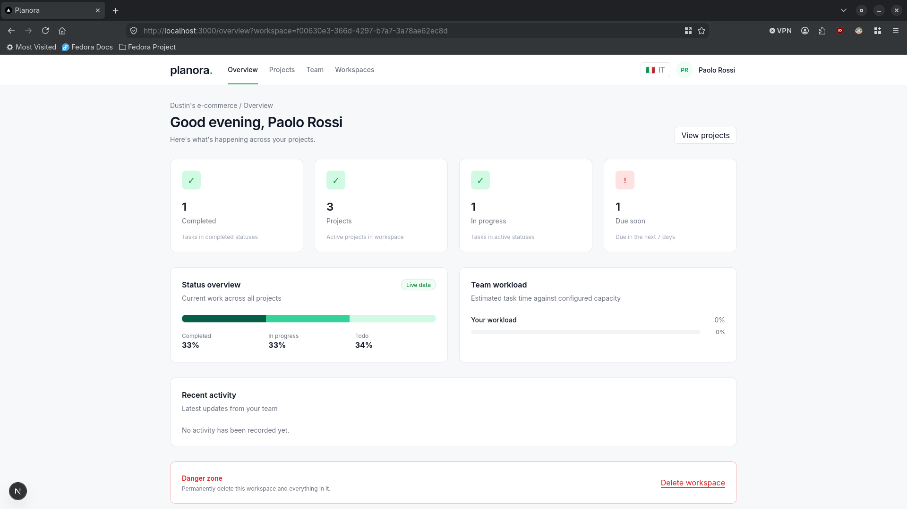
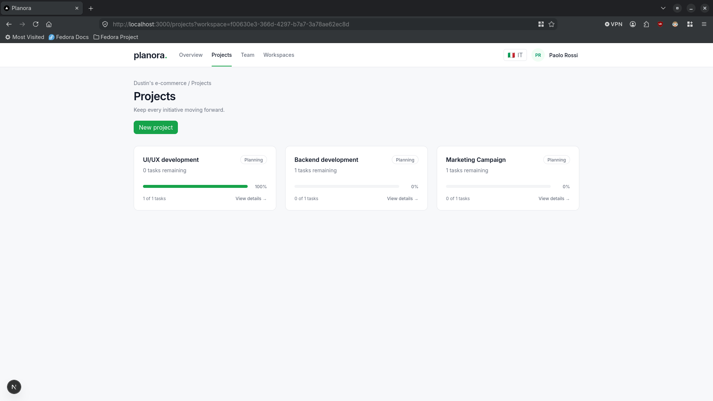
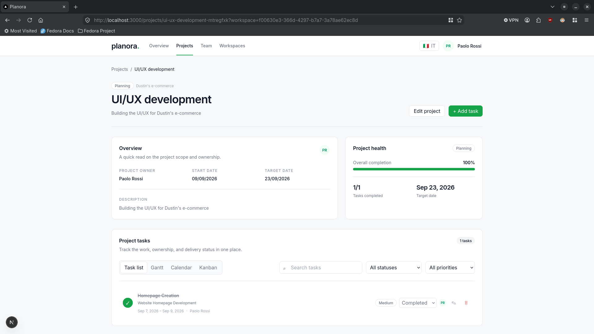
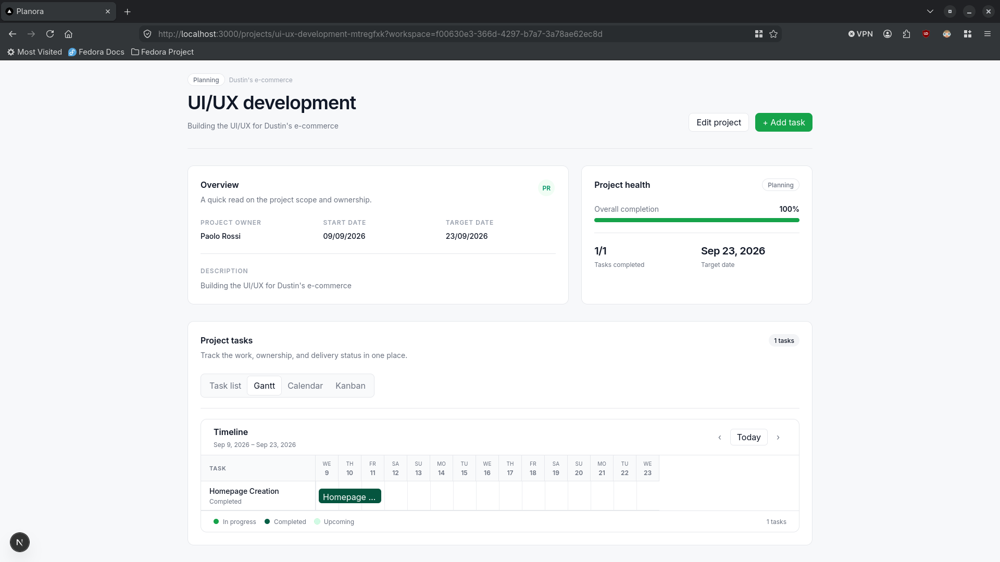
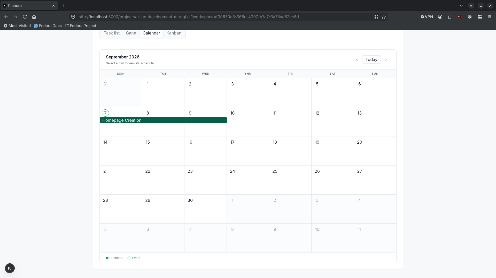
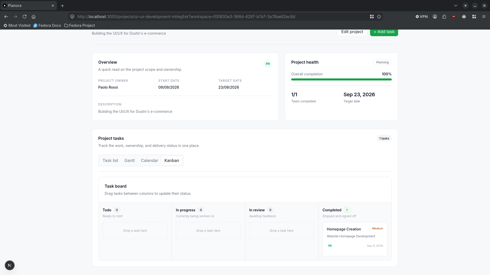
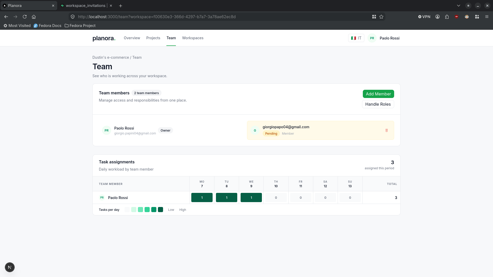

## Features

- **Auth** — email/password sign-up and sign-in via Supabase Auth, with account deletion and safe redirect handling for invitation links.
- **Overview dashboard** — completed tasks, active projects, in-progress tasks, upcoming deadlines, status distribution, team workload vs. configured capacity, and a recent activity feed.
- **Projects** — create, edit, and delete projects (deletion requires typing the name). Progress is computed from task status, not a stored counter.
- **Tasks** — full CRUD with search, status/priority filters, and four views: task list, Gantt, calendar, and Kanban.
- **Team management** — invite members by email (Resend), assign roles, manage custom roles, and see a weekly assignment heatmap per member.
- **Permissions** — workspace capabilities enforced both in server actions and in Postgres row-level security policies.
- **i18n** — English and Italian, locale stored in a cookie.

## Stack

- Next.js 16 (App Router), React 19, TypeScript 5
- Supabase (`@supabase/supabase-js` + `@supabase/ssr`) for database, auth, and cookie sessions
- Tailwind CSS 4
- Resend for invitation emails

## Project structure

```text
app/
  landing/ signin/ signup/ accept-invitation/ dev/
  (private)/workspaces/           # workspace selector
  (private)/(app)/                # authenticated shell: overview, projects, team
  actions.ts                      # server actions
components/ui/                    # reusable primitives
components/                       # AppNav, AuthForm, ProjectWorkspace, TeamMemberForm...
lib/                              # data, workspace helpers, i18n, resend, supabase clients
supabase/migrations/              # ordered PostgreSQL migrations
```

## Getting started

Requires Node.js and npm.

```bash
git clone <repo-url> planora
cd planora
npm install
```

Create `.env.local` in the project root:

```dotenv
NEXT_PUBLIC_SUPABASE_URL=https://your-project.supabase.co
NEXT_PUBLIC_SUPABASE_ANON_KEY=your-anon-key
RESEND_API_KEY=re_your_api_key        # only needed for email invitations
NEXT_PUBLIC_APP_URL=http://localhost:3000
```

Restart the dev server after changing env vars.

### Supabase setup

1. Create a Supabase project and enable the email/password provider.
2. Run the migrations in `supabase/migrations/` in filename order (the SQL editor works fine). `SQL.txt` holds the consolidated schema for reference.
3. Set the auth Site URL to `http://localhost:3000` for development; add your production URL when deploying.
4. For production invitation emails, verify a sending domain in Resend and set `RESEND_FROM_EMAIL`.

### Run

```bash
npm run dev        # http://localhost:3000
npm run build      # production build
npm run start      # serve the build
npm run lint
npx tsc --noEmit   # type-check
```

Sign up through the app, create a workspace, and you're in.

## Notes

- **Security** — RLS is enabled on all application tables; authorization is enforced server-side too. Deletion flows require exact-name confirmation, and the service-role key never appears in client code.
- **Design** — see `DESIGN.md`. Light theme, borders over shadows, green reserved for primary/positive states, keyboard-visible focus.
- **`/dev` route** — a local component gallery using preview data; not part of the product flow.
